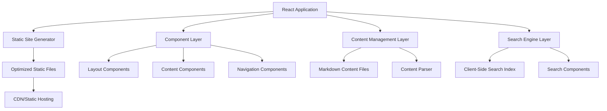

# Design Document

## Overview

The Health Standards Website is a React-based static educational platform that provides comprehensive information about healthcare interoperability standards including HL7, FHIR, DICOM, and related protocols. The system will be built using modern React practices with static site generation for optimal performance and SEO, featuring a component-based architecture that supports easy content management and maintenance.

The website will serve as a centralized knowledge base for healthcare professionals, developers, and students, providing structured information about each standard including specifications, use cases, examples, and implementation guidance - all clearly marked as educational content only.

## Architecture

### High-Level Architecture



### Technology Stack

- **Frontend Framework**: React 18+ with TypeScript for type safety
- **Static Site Generation**: Next.js with static export or Gatsby for SEO optimization
- **Styling**: Tailwind CSS for responsive design and accessibility
- **Content Management**: Markdown files with frontmatter for structured content
- **Search**: Lunr.js or Fuse.js for client-side full-text search
- **Build Tools**: Webpack/Vite for bundling and optimization
- **Deployment**: Static hosting (Netlify, Vercel, or AWS S3 + CloudFront)

## Components and Interfaces

### Core Components

#### Layout Components
- **Header**: Contains site branding, main navigation, and search bar
- **Footer**: Educational disclaimer, legal information, and additional links
- **Sidebar**: Secondary navigation for standard-specific content
- **Disclaimer Banner**: Prominent educational purpose notification

#### Content Components
- **StandardPage**: Main template for individual healthcare standard pages
- **ContentSection**: Reusable component for structured content blocks
- **CodeExample**: Syntax-highlighted code samples with copy functionality
- **DiagramViewer**: Component for displaying healthcare workflow diagrams
- **TableOfContents**: Auto-generated navigation for long content pages

#### Navigation Components
- **MainNavigation**: Primary site navigation with dropdown menus
- **Breadcrumbs**: Hierarchical navigation showing current page location
- **StandardsMenu**: Specialized navigation for healthcare standards
- **SearchInterface**: Search input with autocomplete and results display

#### Interactive Components
- **SearchResults**: Displays search results with highlighting and pagination
- **ContentFilter**: Allows filtering content by standard type or category
- **ResponsiveMenu**: Mobile-friendly navigation with hamburger menu

### Data Interfaces

#### Content Structure
```typescript
interface HealthcareStandard {
  id: string;
  name: string;
  version: string;
  description: string;
  category: 'messaging' | 'imaging' | 'terminology' | 'security';
  content: ContentSection[];
  lastUpdated: Date;
  officialUrl: string;
}

interface ContentSection {
  id: string;
  title: string;
  content: string;
  examples?: CodeExample[];
  diagrams?: DiagramReference[];
  subsections?: ContentSection[];
}
```

#### Search Interface
```typescript
interface SearchIndex {
  documents: SearchDocument[];
  index: SearchIndexData;
}

interface SearchResult {
  id: string;
  title: string;
  excerpt: string;
  url: string;
  relevanceScore: number;
  highlightedText: string[];
}
```

## Data Models

### Content Organization

Healthcare standards content will be organized in a hierarchical structure:

```
content/
├── standards/
│   ├── hl7/
│   │   ├── index.md
│   │   ├── v2/
│   │   ├── v3/
│   │   └── fhir/
│   ├── dicom/
│   │   ├── index.md
│   │   ├── basics/
│   │   └── implementation/
│   └── other-standards/
├── glossary/
├── use-cases/
└── resources/
```

### Content Metadata

Each content file will include frontmatter with structured metadata:

```yaml
---
title: "HL7 FHIR Overview"
standard: "HL7"
version: "R4"
category: "messaging"
difficulty: "beginner"
lastUpdated: "2024-12-13"
tags: ["interoperability", "api", "rest"]
officialSpec: "https://hl7.org/fhir/"
---
```

### Search Index Structure

The search system will maintain an inverted index of all content:

```typescript
interface SearchDocument {
  id: string;
  title: string;
  content: string;
  standard: string;
  category: string;
  url: string;
  tags: string[];
}
```

## Correctness Properties

*A property is a characteristic or behavior that should hold true across all valid executions of a system-essentially, a formal statement about what the system should do. Properties serve as the bridge between human-readable specifications and machine-verifiable correctness guarantees.*

### Property Reflection

After analyzing all acceptance criteria, I identified several areas where properties can be consolidated:

- Navigation properties (3.1-3.5) can be combined into comprehensive navigation consistency properties
- Disclaimer properties (5.1-5.5) can be consolidated into disclaimer presence and content properties  
- Search properties (2.1-2.3, 2.5) can be combined into comprehensive search behavior properties
- Accessibility properties (6.1, 6.2, 6.4, 6.5) can be consolidated into comprehensive accessibility compliance

### Core Properties

**Property 1: Standard navigation consistency**
*For any* healthcare standard page, selecting it from navigation should navigate to a dedicated content page with structured information including examples and use cases
**Validates: Requirements 1.2, 1.3**

**Property 2: Search functionality completeness**
*For any* valid search terms, the search should return relevant results from all healthcare standards content with highlighted matching text and context
**Validates: Requirements 2.1, 2.2**

**Property 3: Empty search input validation**
*For any* string composed entirely of whitespace, performing a search should be prevented and the current state should remain unchanged
**Validates: Requirements 2.3**

**Property 4: Real-time search suggestions**
*For any* text input in the search field, the system should provide relevant autocomplete suggestions based on available content
**Validates: Requirements 2.5**

**Property 5: Universal navigation presence**
*For any* page on the website, it should display a consistent navigation system with all available healthcare standards and a clear path back to the homepage
**Validates: Requirements 3.1, 3.4**

**Property 6: Navigation state indication**
*For any* healthcare standard page being viewed, the navigation system should highlight the current section and show accurate breadcrumb hierarchy
**Validates: Requirements 3.3, 3.5**

**Property 7: Navigation transitions**
*For any* navigation item clicked, the system should transition smoothly to the corresponding content page
**Validates: Requirements 3.2**

**Property 8: Static site optimization**
*For any* page deployment, the system should generate optimized static files that load without server dependencies
**Validates: Requirements 1.4, 4.3**

**Property 9: Content auto-inclusion**
*For any* new healthcare standard content added to the system, it should automatically appear in navigation menus and search results
**Validates: Requirements 4.4**

**Property 10: Universal disclaimer presence**
*For any* page on the website, it should display a prominent educational disclaimer stating the content is for educational purposes only and should not be used for actual healthcare implementation
**Validates: Requirements 5.1, 5.2**

**Property 11: Official documentation references**
*For any* healthcare standards content page, it should include reminders to consult official standard documentation for implementation
**Validates: Requirements 5.3**

**Property 12: Disclaimer persistence**
*For any* page displaying the educational disclaimer, it should be easily readable and not dismissible to ensure legal compliance
**Validates: Requirements 5.4, 5.5**

**Property 13: Responsive design consistency**
*For any* viewport size (desktop, tablet, mobile), the website should display content appropriately with proper responsive behavior
**Validates: Requirements 1.5**

**Property 14: Accessibility compliance**
*For any* page on the website, it should meet WCAG accessibility guidelines including proper focus indicators, logical tab order, and alternative text for images
**Validates: Requirements 6.1, 6.2, 6.4**

**Property 15: Color accessibility**
*For any* information conveyed using color, the website should provide alternative methods to distinguish content for accessibility
**Validates: Requirements 6.5**

<function_calls>
<invoke name="prework">
<parameter name="featureName">health-standards-website

## Error Handling

### Content Loading Errors
- **Missing Content**: Display user-friendly error messages when content files are missing or corrupted
- **Invalid Markdown**: Gracefully handle malformed markdown with fallback rendering
- **Broken Links**: Detect and report broken internal links during build process
- **Image Loading**: Provide fallback text and retry mechanisms for failed image loads

### Search Errors
- **Index Corruption**: Rebuild search index automatically if corruption is detected
- **Query Parsing**: Handle malformed search queries with helpful error messages
- **No Results**: Display helpful suggestions and popular content when searches return no results
- **Performance**: Implement query throttling to prevent search performance issues

### Navigation Errors
- **404 Handling**: Provide custom 404 pages with navigation back to main content
- **Route Conflicts**: Detect and resolve conflicting routes during build process
- **Deep Linking**: Ensure all content pages support direct URL access
- **History Management**: Handle browser back/forward navigation correctly

### Accessibility Errors
- **Screen Reader**: Provide meaningful error announcements for assistive technologies
- **Keyboard Navigation**: Ensure error states are accessible via keyboard navigation
- **Focus Management**: Maintain proper focus management during error states
- **Color Contrast**: Ensure error messages meet color contrast requirements

## Testing Strategy

### Dual Testing Approach

The testing strategy employs both unit testing and property-based testing to ensure comprehensive coverage:

- **Unit tests** verify specific examples, edge cases, and error conditions
- **Property tests** verify universal properties that should hold across all inputs
- Together they provide comprehensive coverage: unit tests catch concrete bugs, property tests verify general correctness

### Unit Testing Requirements

Unit tests will focus on:
- Specific examples that demonstrate correct behavior (homepage content, 404 pages)
- Component integration points (search integration, navigation state)
- Error conditions and edge cases (malformed content, network failures)
- Accessibility compliance for specific scenarios

### Property-Based Testing Requirements

Property-based testing will use **fast-check** for JavaScript/TypeScript to verify universal properties:

- Each property-based test will run a minimum of 100 iterations for thorough coverage
- Each test will be tagged with comments explicitly referencing the correctness property from this design document
- Test tags will use the format: `**Feature: health-standards-website, Property {number}: {property_text}**`
- Each correctness property will be implemented by a single property-based test

Property tests will generate:
- Random healthcare standard content structures
- Various viewport sizes for responsive testing
- Different search query patterns
- Random navigation paths through the site
- Various accessibility scenarios (keyboard navigation, screen reader usage)

### Testing Tools and Framework

- **Testing Framework**: Jest with React Testing Library for component testing
- **Property-Based Testing**: fast-check library for generating test cases
- **Accessibility Testing**: @testing-library/jest-dom and axe-core for automated accessibility checks
- **Visual Testing**: Storybook for component documentation and visual regression testing
- **E2E Testing**: Playwright for end-to-end user journey validation

### Test Organization

```
tests/
├── unit/
│   ├── components/
│   ├── utils/
│   └── integration/
├── property/
│   ├── navigation.property.test.ts
│   ├── search.property.test.ts
│   ├── content.property.test.ts
│   └── accessibility.property.test.ts
├── fixtures/
│   ├── sample-content/
│   └── test-data/
└── helpers/
    ├── generators.ts
    └── test-utils.ts
```

### Continuous Integration

- All tests must pass before deployment
- Property-based tests will run with increased iteration counts in CI (500+ iterations)
- Accessibility tests will be mandatory for all pull requests
- Performance budgets will be enforced for static asset sizes