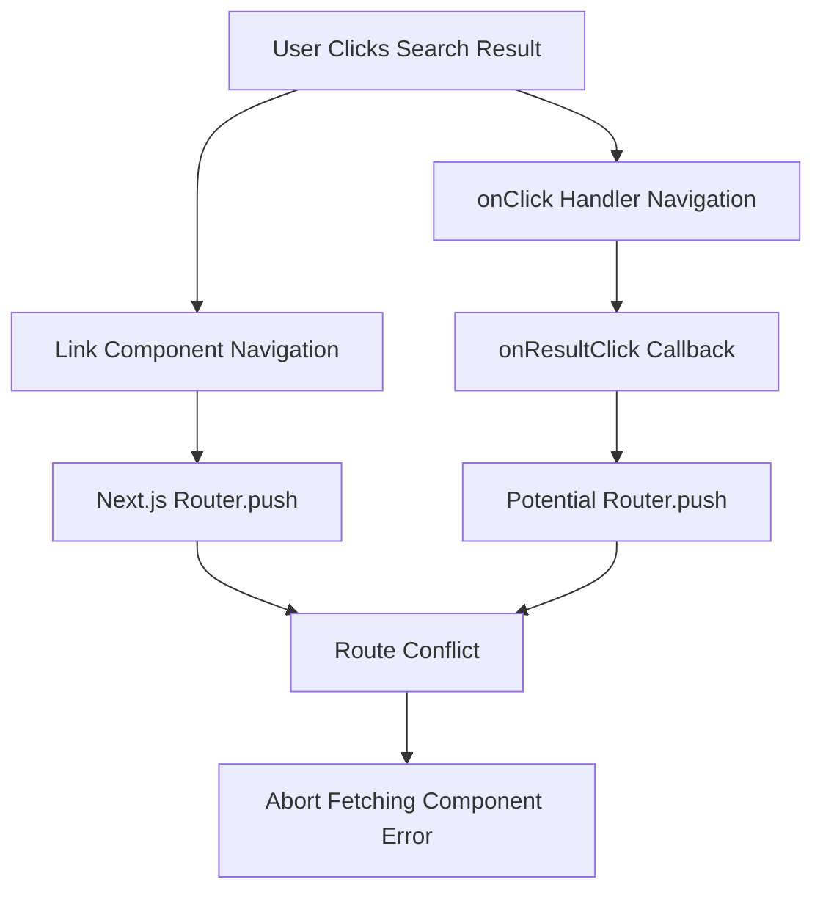
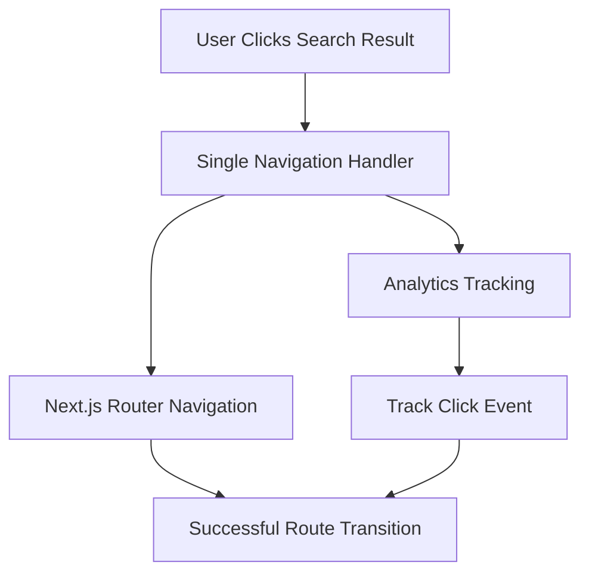

# Design Document

## Overview

The navigation routing fix addresses critical routing conflicts in the health standards website's search functionality. The primary issue stems from conflicting navigation mechanisms in the SearchResults component where both Next.js Link components and onClick handlers attempt to handle the same user interaction, causing "Abort fetching component for route" errors.

The solution involves refactoring the navigation logic to use a single, consistent approach for handling search result clicks while maintaining analytics tracking and proper accessibility support.

## Architecture

### Current Problem Architecture



### Proposed Solution Architecture



## Components and Interfaces

### Modified Components

#### SearchResults Component
The primary component requiring modification to resolve navigation conflicts.

**Current Issues:**
- Dual navigation mechanisms (Link + onClick)
- Conflicting router calls
- Improper event handling

**Proposed Changes:**
- Single navigation approach using either Link or programmatic navigation
- Proper event handling with preventDefault when needed
- Clean separation of analytics and navigation concerns

#### Navigation Event Interface
```typescript
interface NavigationEvent {
  result: SearchResult;
  analyticsData?: {
    query: string;
    position: number;
    timestamp: Date;
  };
  preventDefault?: boolean;
}

interface NavigationHandler {
  handleResultClick: (event: NavigationEvent) => void;
  trackAnalytics: (result: SearchResult, query: string) => void;
}
```

### Navigation Strategy Options

#### Option 1: Pure Link Components (Recommended)
- Use Next.js Link components exclusively
- Handle analytics through Link's onClick without navigation interference
- Simplest and most reliable approach

#### Option 2: Programmatic Navigation
- Remove Link components, use button elements
- Handle all navigation through router.push
- More control but requires careful event management

## Data Models

### Navigation State Management
```typescript
interface NavigationState {
  isNavigating: boolean;
  currentRoute: string;
  previousRoute: string;
  navigationError?: string;
}

interface SearchResultNavigation {
  resultId: string;
  targetUrl: string;
  navigationMethod: 'link' | 'programmatic';
  analyticsTracked: boolean;
}
```

## Correctness Properties

*A property is a characteristic or behavior that should hold true across all valid executions of a system-essentially, a formal statement about what the system should do. Properties serve as the bridge between human-readable specifications and machine-verifiable correctness guarantees.*

<function_calls>
<invoke name="prework">
<parameter name="featureName">navigation-routing-fix

### Property Reflection

After analyzing all acceptance criteria, I identified several areas where properties can be consolidated:

- Navigation success properties (1.1, 1.2, 1.4) can be combined into a comprehensive navigation completion property
- Navigation mechanism properties (2.1, 2.2) can be consolidated into a single navigation consistency property
- URL and state management properties (2.4, 3.2) can be combined into navigation state consistency
- General navigation properties (3.1, 3.3) can be consolidated into overall navigation reliability

### Core Properties

**Property 1: Search result navigation completion**
*For any* valid search result with a target URL, clicking on it should successfully navigate to the target page without routing errors or aborted component loading
**Validates: Requirements 1.1, 1.2, 1.4**

**Property 2: Single navigation mechanism consistency**
*For any* search result item rendered, it should use exactly one navigation mechanism without conflicting onClick handlers or duplicate navigation attempts
**Validates: Requirements 2.1, 2.2**

**Property 3: Event handling correctness**
*For any* navigation interaction that requires programmatic handling, the system should prevent default link behavior appropriately without causing navigation conflicts
**Validates: Requirements 2.3**

**Property 4: Navigation state consistency**
*For any* navigation event, URL parameters should update correctly and browser history should be managed properly without conflicts
**Validates: Requirements 2.4, 3.2**

**Property 5: Analytics tracking without interference**
*For any* search result click that requires analytics tracking, the tracking should complete without interfering with or preventing the navigation process
**Validates: Requirements 2.5**

**Property 6: Universal navigation reliability**
*For any* navigation link in the application, clicking it should provide consistent behavior and successfully load the correct page content
**Validates: Requirements 3.1, 3.3**

**Property 7: Accessibility focus management**
*For any* navigation event, proper focus management should be maintained for accessibility compliance during the transition
**Validates: Requirements 3.4**

## Error Handling

### Navigation Error Recovery
- **Route Conflicts**: Detect and prevent multiple simultaneous navigation attempts
- **Component Loading Failures**: Provide fallback mechanisms when component loading fails
- **Invalid URLs**: Validate URLs before navigation and provide meaningful error messages
- **Network Issues**: Handle network-related navigation failures gracefully

### User Experience During Errors
- **Loading States**: Show appropriate loading indicators during navigation
- **Error Messages**: Display user-friendly error messages for navigation failures
- **Retry Mechanisms**: Provide options to retry failed navigation attempts
- **Fallback Navigation**: Offer alternative navigation paths when primary routes fail

## Testing Strategy

### Dual Testing Approach

The testing strategy employs both unit testing and property-based testing to ensure comprehensive coverage:

- **Unit tests** verify specific navigation scenarios, error conditions, and component integration
- **Property tests** verify universal navigation properties that should hold across all user interactions
- Together they provide comprehensive coverage: unit tests catch specific navigation bugs, property tests verify general navigation correctness

### Unit Testing Requirements

Unit tests will focus on:
- Specific navigation scenarios (search result clicks, back button usage)
- Error conditions (invalid URLs, network failures, component loading errors)
- Component integration (SearchResults with navigation, analytics integration)
- Accessibility compliance for navigation interactions

### Property-Based Testing Requirements

Property-based testing will use **fast-check** for JavaScript/TypeScript to verify universal navigation properties:

- Each property-based test will run a minimum of 100 iterations for thorough coverage
- Each test will be tagged with comments explicitly referencing the correctness property from this design document
- Test tags will use the format: `**Feature: navigation-routing-fix, Property {number}: {property_text}**`
- Each correctness property will be implemented by a single property-based test

Property tests will generate:
- Random search results with various URL patterns
- Different navigation interaction patterns (clicks, keyboard navigation)
- Various browser states (history, URL parameters)
- Different timing scenarios for navigation events
- Random analytics data and tracking scenarios

### Testing Tools and Framework

- **Testing Framework**: Jest with React Testing Library for component testing
- **Property-Based Testing**: fast-check library for generating test cases
- **Navigation Testing**: Custom utilities for simulating navigation events
- **Router Testing**: Next.js router mocking and testing utilities
- **Accessibility Testing**: @testing-library/jest-dom for focus management testing

### Test Organization

```
tests/
├── unit/
│   ├── navigation/
│   │   ├── search-results-navigation.test.tsx
│   │   ├── router-integration.test.ts
│   │   └── analytics-tracking.test.ts
│   └── integration/
│       └── navigation-flow.test.tsx
├── property/
│   ├── navigation-completion.property.test.ts
│   ├── navigation-consistency.property.test.ts
│   ├── event-handling.property.test.ts
│   └── accessibility-navigation.property.test.ts
├── fixtures/
│   ├── search-results/
│   └── navigation-scenarios/
└── helpers/
    ├── navigation-generators.ts
    └── router-test-utils.ts
```

### Continuous Integration

- All navigation tests must pass before deployment
- Property-based tests will run with increased iteration counts in CI (500+ iterations)
- Navigation accessibility tests will be mandatory for all pull requests
- Performance testing for navigation transitions will be included in CI pipeline